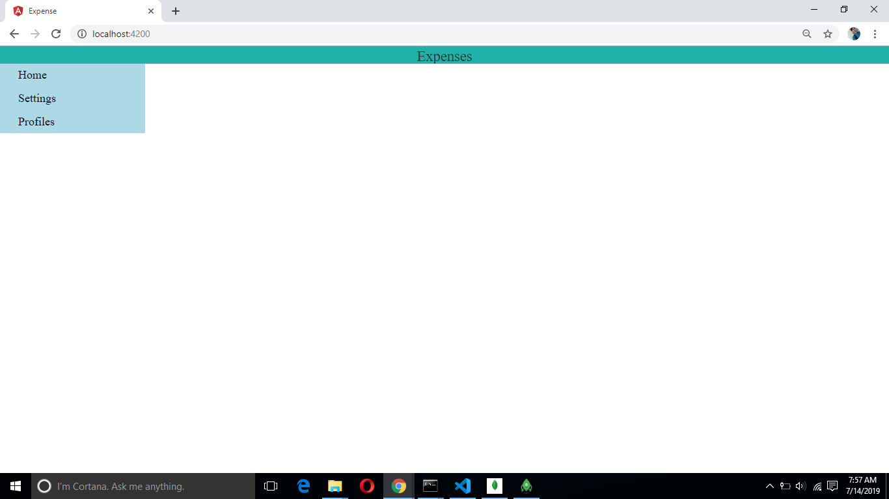
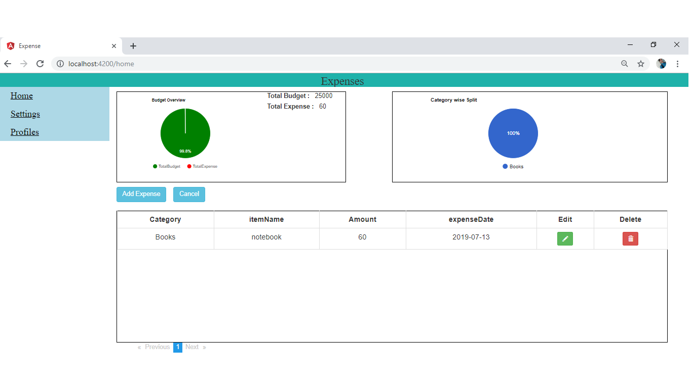
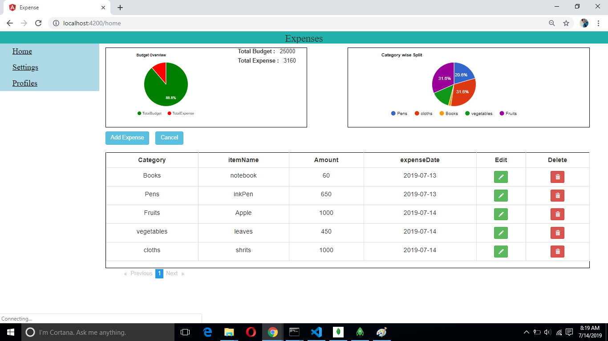
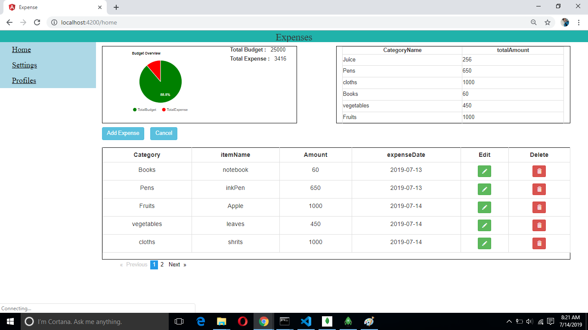
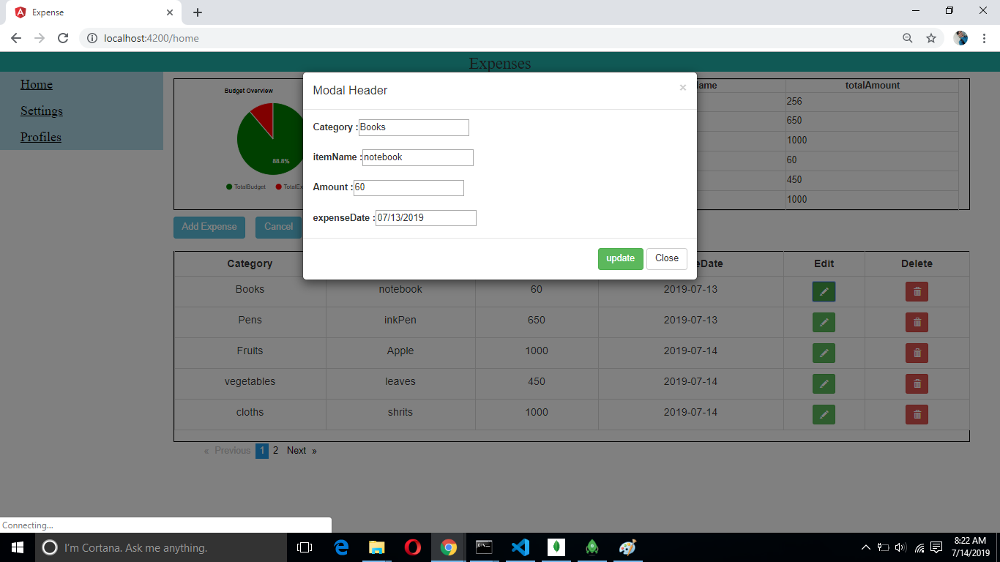
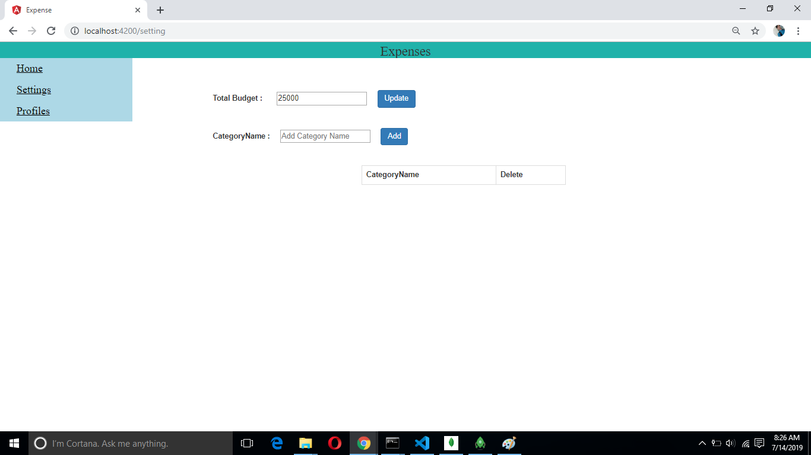
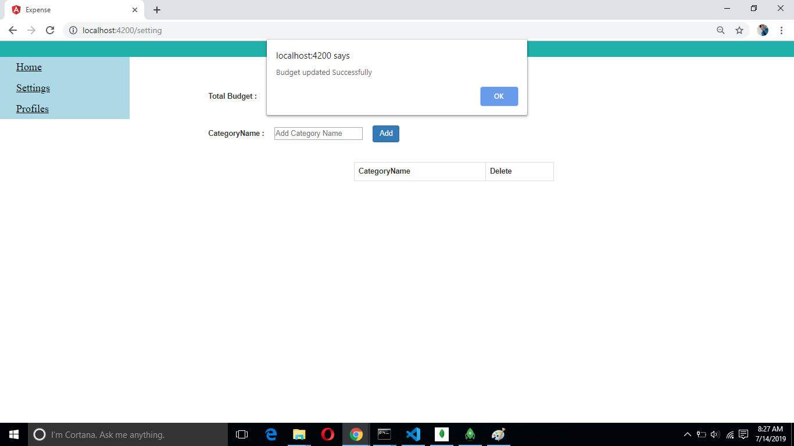
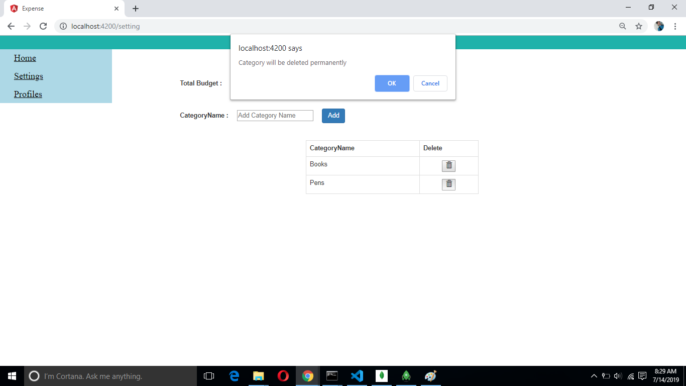

# vinayakTask
Appiness Task

1.Pull the code from the repository into local system.
2.go to the project folder in the local system and do "npm i" for installing the necessary dependencies to run the project.
3.Once completed Do "ng serve" for running the angular code.
4.Start your mongoDB server in local system and create a database named "Expense".(mandatory)
5.once mongoDB server is running then Go to the project folder path in new command prompt and run "node server".
6.External depency for graph - I am using ng2-google charts for graph.

screenshots

